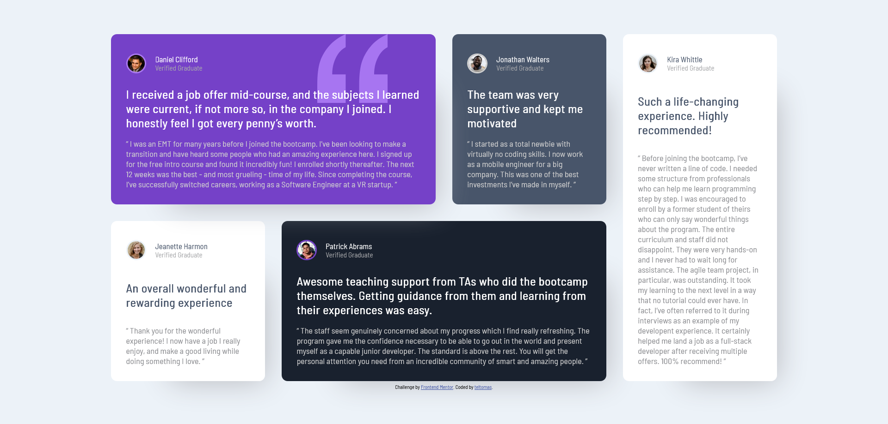

# Frontend Mentor - Testimonials grid section

## The Challenge:

The challenge was to build out this testimonials grid section and get it looking as close to the design as possible.

I would be able to use any tools I would like.

The viewers of the page should be able to:

- View the optimal layout for the site depending on their device's screen size.

The task was to build out the project to the designs inside the `/design` folder, where I would find both a mobile and a desktop version of the design. 

The designs are in JPG static format so it meant that I would need to use my best judgment for styles such as `font-size`, `padding` and `margin`. 

## Building the project

I would be able to use any workflow that I felt comfortable with. So ended up using a simple HTML and CSS stack.

## My solution

# Hope you like it!